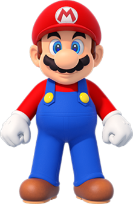
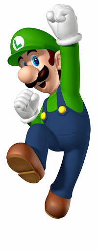
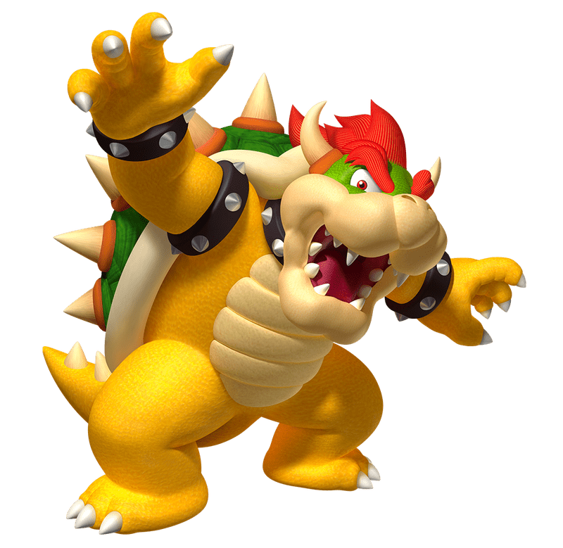

<h1>ACTIVITAT README</h1>
<!-- start project-info -->
<!--
project title: Què conté un arxiu README.MD
--->

<!-- end project info -->

<!-- start initial description -->
<h2 style:" text-align: center;"> Què conté un readme? </h2>
<p>
Un readme ha de contenir els següents apartats:
<ul>
    <li>Introducció al projecte, és a dir, informació bàsica per entendre de què tracta</li>
    <li>Si el projecte necessita algun tipus de prerequisit</li>
    <li>Per a que s'utilitza el programa</li>
    <li>Les llicències que necessitarà el programa</li>
</ul>
</p>
<!-- end initial description -->

<!-- package installation example -->
## Possibles paquets a instal·lar</h2>
- Per marcar una comanda per a executar, pots fer aixo: 
```
sudo pkg-install guest-additionsx64.pkg
```
Aquesta comanda podria servir per a instal·lar les guestAddittions
<!-- end of package instalation example -->

<!-- commands example -->
## Possibles comandes que pugui executar el nostre programa
- Per exemple, si volem mostrar una combinació de tecles que fa una acció en concret, podem fer aixo:
- Obrir un nou fitxer (`Ctrl+N`)

# SUPER MARIO BROS
 
<!-- Initial Description -->
- project title: Super Mario Bros description (README.MD)
<!-- End Initial Description -->

<!-- General Information -->
## Informació General
Super Mario és un videojoc de plataformes de Nintendo creat fa 36 anys que actualment és famós a tot el món </p>
Les Característiques principals dels deus videojocs són:
- Varietat d'escenaris (gran quantitat de mons)
- Una gran paleta de colors que fan que aquesta saga sigui única
- Enemics fàcils de derrotar (ja que el joc es basa en les plataformes)
- Nivells amb escenaris interactius
- Enemics finals carismàtics
- Protagonista principal considerat com heroi
<!-- End general information -->

<!-- Control Explanation -->
## Controls
- Moure't per l'escenari:
```
Arrows/Joystick
```
- Saltar
```
A / B
``` 
- Correr
```
Y / X + Arrows / Joystick 
```
- Fer ús de l'habilitat 
```
Y / X
```
<!-- End of Control Explanation -->

<!-- Main Characters Explanation -->
<h1>Personatges Principals</h1>

| Nom | Descripcio | Foto |
| ------- | ------- | ------- |
| Super Mario | El protagonista principal, un fontaner que s'encarregarà de salvar a la princesa |  |
| Luigi | El germà del protagonista, ajudarà a en Mario a salvar a la Princesa |  |
| Bowser | L'antagonista de la saga, farà el possible per a que en Mario i en Luigi no puguin rescatar la princesa |  |
